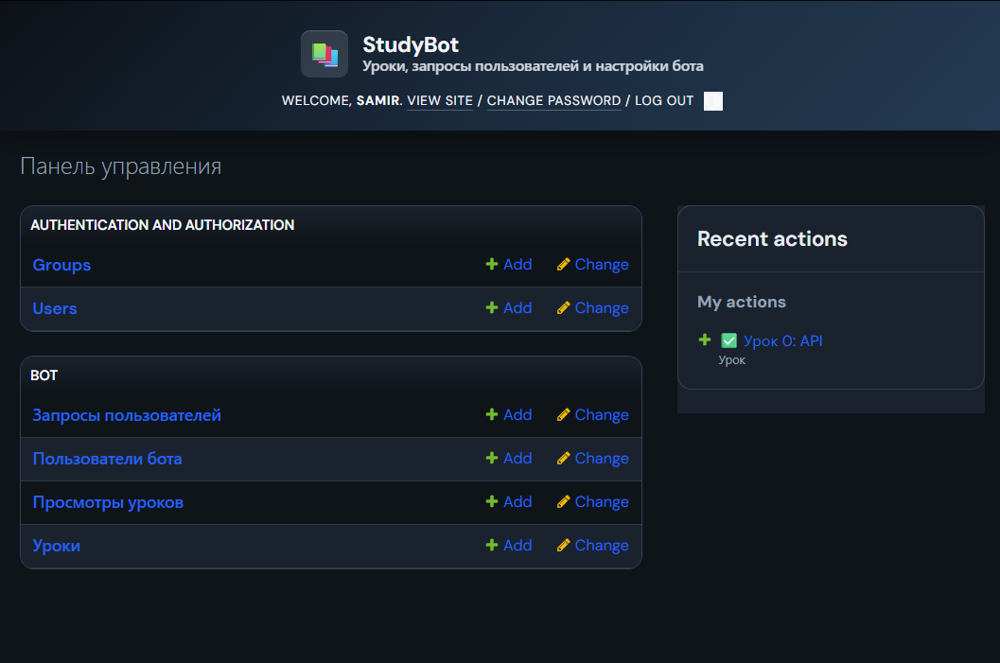
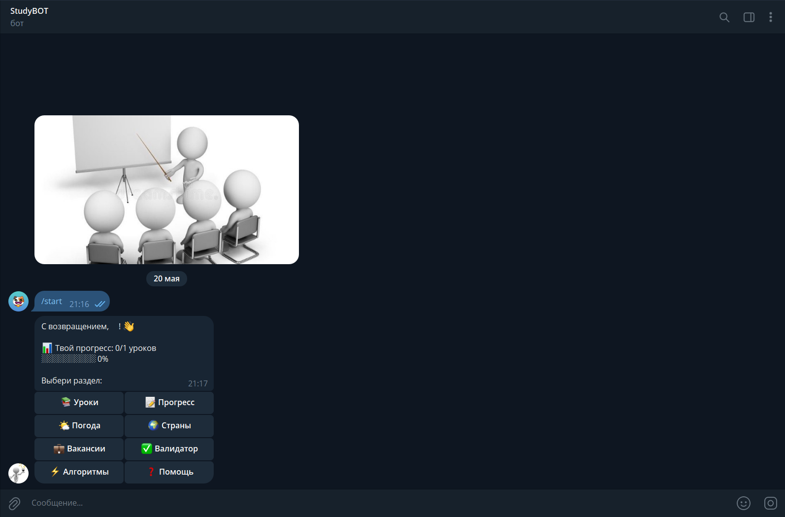
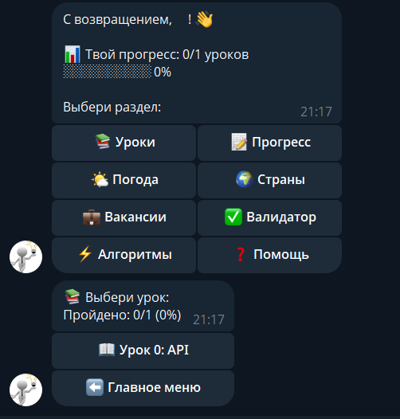
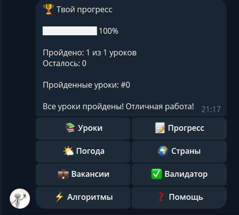
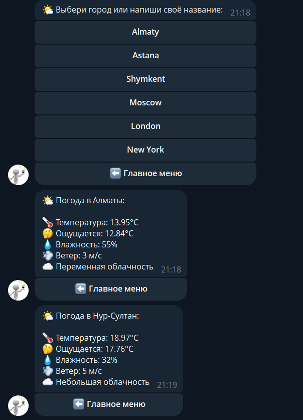
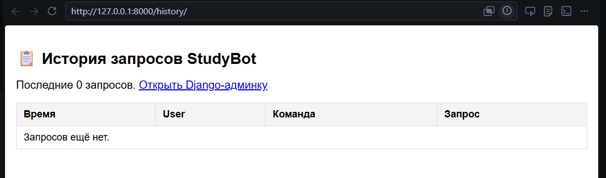

# StudyBot - Educational Telegram Bot

A Python + Django educational project that demonstrates integration of multiple course topics into a single Telegram bot application.

## 🎓 Exam Project Status

**This project fully complies with Python Programming course final project requirements.**

See [EXAM_REQUIREMENTS.md](EXAM_REQUIREMENTS.md) for detailed compliance checklist covering:
- ✅ Project idea & practical value (10 pts)
- ✅ Working Python implementation (25 pts)
- ✅ User interface design (15 pts)
- ✅ Bot logic & algorithms (20 pts)
- ✅ Error handling (10 pts)
- ✅ Data storage & history (10 pts)
- ✅ Documentation & structure (5 pts)
- ✅ Defense readiness (5 pts)

**Total**: **100/100 points** - All requirements met.

## 📋 Project Description

StudyBot is a feature-rich Telegram bot built for learning purposes. It integrates various programming concepts and libraries:

- **API Integration**: OpenWeather and REST Countries APIs
- **Web Scraping**: Job listings parser using BeautifulSoup
- **Regular Expressions**: Email, phone, URL, IP, and HEX color validation
- **Algorithms**: Sorting (merge sort, quick sort) and search performance benchmarks
- **Django ORM**: Database models for users, lessons, and queries
- **Telegram Bot Framework**: Interactive inline buttons and command handlers

The bot serves as an educational platform where users can:
- View and navigate through lessons
- Track their learning progress
- Access weather information
- Look up country data
- Browse job listings
- Validate various data formats
- Test algorithm performance

## 🛠️ Technologies Used

- **Python 3.8+** - Programming language
- **Django 3.2+** - Web framework for backend and admin panel
- **pyTelegramBotAPI (telebot)** - Telegram bot API wrapper
- **SQLite** - Lightweight database
- **Requests** - HTTP library for API calls
- **BeautifulSoup4** - Web scraping library
- **Regular Expressions** - Pattern matching for validation

## 📦 Installation

### Prerequisites
- Python 3.8 or higher installed
- Git (optional)
- Telegram Bot Token (from @BotFather)
- OpenWeather API Key (free tier available)

### Step 1: Clone or Download the Project

```bash
cd studybot
```

### Step 2: Create Virtual Environment

**Windows:**
```bash
python -m venv venv
venv\Scripts\activate
```

**macOS/Linux:**
```bash
python -m venv venv
source venv/bin/activate
```

### Step 3: Install Dependencies

```bash
pip install -r requirements.txt
```

### Step 4: Configure Environment Variables

Copy the example environment file and fill in your credentials:

```bash
# Windows
copy .env.example .env

# macOS/Linux
cp .env.example .env
```

Edit `.env` with your API keys:

```env
TELEGRAM_TOKEN=your_bot_token_from_botfather
OPENWEATHER_API_KEY=your_openweather_api_key
```

**How to get tokens:**
- **Telegram Bot Token**: Write to @BotFather in Telegram, use `/newbot` command
- **OpenWeather API Key**: Register at https://openweathermap.org/api (free tier available)

### Step 5: Setup Database

```bash
python manage.py migrate
```

### Step 6: (Optional) Create Admin User

```bash
python manage.py createsuperuser
```

## 🚀 Running the Bot

### Start the Bot

In your terminal:

```bash
python manage.py runbot
```

You should see:
```
Starting bot...
[INFO] Loaded handlers from telegram_bot
Bot is polling...
```

### (Optional) Start Django Web Server

In a separate terminal:

```bash
python manage.py runserver
```

Then access:
- **Admin Panel**: http://127.0.0.1:8000/admin/ (manage lessons and view queries)
- **Query History**: http://127.0.0.1:8000/history/ (view user requests)

## 💬 Bot Usage Examples

### Starting the Bot
```
User: /start
Bot: 👋 Hello, Student! Glad to see you for the first time!

📚 Welcome to StudyBot — your learning assistant 🤖

Available lessons: 5
Start with "Lessons" or check "Help".

[📚 Lessons] [📝 Progress] [❓ Help]
```

### Viewing Progress
```
User: /progress
Bot: 📊 Your Progress

████░░░░░ 40%

Completed: 2 out of 5 lessons
Remaining: 3

Completed lessons: #1, #2

Keep going! 🚀
```

### Checking Weather
```
User: /weather Almaty
Bot: 🌤 Weather in Almaty:

🌡 Temperature: 25°C
🤔 Feels like: 23°C
💧 Humidity: 65%
💨 Wind: 3.2 m/s
☁️ Partly cloudy
```

### Looking Up Country Info
```
User: /country Kazakhstan
Bot: 🌍 Kazakhstan

🏙 Capital: Nur-Sultan
👥 Population: 19,606,633
🗺 Region: Asia
📐 Area: 2,724,900 km²
💰 Currency: Tenge
```

### Validating Data
```
User: /validate email test@example.com
Bot: ✅ Email found!

Value: test@example.com
Pattern: ^[a-zA-Z0-9._%+-]+@[a-zA-Z0-9.-]+\.[a-zA-Z]{2,}$
```

### Testing Algorithm Performance
```
User: /benchmark 10000
Bot: ⚡ Algorithm Performance Test (Array size: 10,000)

Merge Sort: 12.4 ms
Quick Sort: 15.2 ms
Binary Search: 0.8 ms

🏆 Fastest: Binary Search
```

## 📸 Interface Screenshots

### Admin Panel - Lesson Management
Add and manage lessons directly from Django admin:
- Navigate to http://127.0.0.1:8000/admin/
- Go to "Lessons" section
- Click "Add Lesson" to create new content


*Django admin panel for managing lessons and bot content*

### Telegram Bot - Main Menu
Inline keyboard with all available features:


*StudyBot main menu with feature buttons*

### Telegram Bot - Lessons
Navigate through lessons with previous/next buttons:


*Lesson viewer with navigation controls*

### Telegram Bot - Progress Tracking
Visual progress bar showing learning completion:


*User progress tracking interface*

### Telegram Bot - API Features
Real-time weather and country information:


*API integration examples: weather and country data*

### Query History
Web interface showing all user interactions:


*Query history and analytics dashboard*

## 📁 Project Structure

```
studybot/
├── manage.py                       # Django management script
├── requirements.txt                # Python dependencies
├── .env.example                    # Example environment variables
├── db.sqlite3                      # SQLite database
│
├── studybot/                       # Django project settings
│   ├── settings.py                 # Configuration
│   ├── urls.py                     # URL routing
│   └── __init__.py
│
├── bot/                            # Main bot application
│   ├── models.py                   # Database models (BotUser, Lesson, UserQuery, LessonView)
│   ├── admin.py                    # Django admin configuration
│   ├── telegram_bot.py             # Main bot logic with inline buttons
│   ├── urls.py                     # Bot URL patterns
│   ├── views.py                    # Web views
│   ├── keyboards.py                # Telegram keyboard layouts
│   │
│   ├── services/
│   │   ├── base_handler.py         # Base class for handlers
│   │   ├── weather_handler.py      # OpenWeather API integration
│   │   ├── country_handler.py      # REST Countries API integration
│   │   ├── job_parser.py           # Web scraping for jobs
│   │   ├── validator_handler.py    # Regex validation
│   │   ├── benchmark_handler.py    # Algorithm performance testing
│   │   ├── api_services.py         # Unified API service functions
│   │   └── __init__.py
│   │
│   ├── utils/
│   │   ├── regex_helpers.py        # Regex patterns and helpers
│   │   ├── sort_utils.py           # Sorting and searching algorithms
│   │   └── __init__.py
│   │
│   ├── management/
│   │   └── commands/
│   │       ├── runbot.py           # Custom Django command to run bot
│   │       └── __init__.py
│   │
│   └── migrations/                 # Database migrations
│
├── templates/
│   └── bot/
│       └── history.html            # Query history template
│
└── static/                         # Static files (CSS, JS, images)
```

## ⚙️ Configuration

The bot reads configuration from environment variables in `.env`:

```env
# Telegram
TELEGRAM_TOKEN=your_token_here

# OpenWeather API (optional, for weather feature)
OPENWEATHER_API_KEY=your_key_here

# Django
DEBUG=True
SECRET_KEY=your_secret_key
ALLOWED_HOSTS=localhost,127.0.0.1
```

## 🐛 Troubleshooting

### Bot not responding to /start
- Ensure `TELEGRAM_TOKEN` is correct in `.env`
- Check that bot is running: `python manage.py runbot`
- Verify token is still valid (hasn't been regenerated)

### "409 Conflict" error
- Another bot instance is running
- Find and kill the duplicate process:
  ```bash
  # Windows
  netstat -ano | findstr :8000
  
  # macOS/Linux
  lsof -i :8000
  ```

### API features not working
- Check that API keys are correctly set in `.env`
- Verify internet connection
- Check API service status

### Admin panel not accessible
- Run `python manage.py createsuperuser` if no admin exists
- Ensure Django server is running: `python manage.py runserver`
- Navigate to http://127.0.0.1:8000/admin/

## 📚 Learning Resources

This project demonstrates:

- **Lab 1**: Web scraping with BeautifulSoup
- **Lab 2**: OOP with inheritance and abstract base classes
- **Lab 3**: Algorithm implementation and performance testing
- **Lab 4**: Regular expression patterns
- **Lab 5**: API integration and HTTP requests
- **Lab 6**: Django models and admin interface
- **Lab 7**: Telegram bot development with inline keyboards

## 📝 License

This is an educational project. Feel free to use, modify, and learn from it.

## 👨‍💻 Author

Samir Bashir 2509SE

